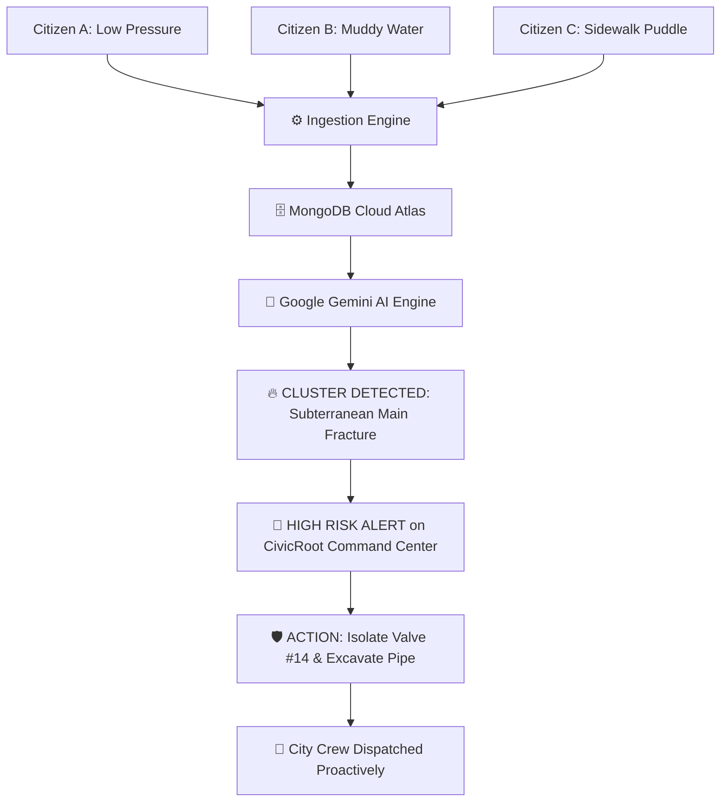

# 📖 JanSetu + CivicRoot AI: Master Project Overview

---

## 🌟 The Big Vision
**JanSetu + CivicRoot AI** is a digital public infrastructure platform that bridges the gap between everyday citizen complaints and proactive city administration.

Instead of treating municipal complaints like isolated customer support tickets, **CivicRoot AI** uses Artificial Intelligence (powered by Google Gemini) to identify hidden root causes, predict infrastructure breakdowns, and advise city engineers to fix problems *before* they turn into catastrophic failures.

```
┌───────────────────────────┐         ┌───────────────────────────┐
│     📱 JANSETU LAYER      │         │    🧠 CIVICROOT LAYER     │
│   (For Everyday Citizens) │ ──────► │   (For City Administrators│
│ • Simple mobile-first form│         │ • AI Pattern Clustering   │
│ • Photo & Voice uploads   │         │ • Live Civic Risk Heatmap │
│ • GPS Location Pinning    │         │ • Root Cause Diagnostics  │
│ • Live Status Tracking    │         │ • Preventive Action Plans │
└───────────────────────────┘         └───────────────────────────┘
```

---

## 🛑 The Problem: The "Isolated Ticket" Trap

Imagine a water pipe starts cracking underneath **Central Park Road**:
1. **Monday:** Resident 1 reports *"low water pressure on the 3rd floor"*. The city marks Ticket #101 and sends a plumber to check the building valve.
2. **Tuesday:** Resident 2 reports *"tap water is brownish and muddy"*. The city marks Ticket #102 and tells the resident to clean their water tank.
3. **Wednesday:** Resident 3 reports *"a big puddle of water on the sidewalk"*. The city marks Ticket #103 and sends a road sweeper.
4. **Thursday:** The main subterranean pipe bursts completely, caving in the road, flooding 20 basements, and costing \$50,000 in emergency repairs.

### 💔 Why did this happen?
Because existing systems (like traditional 311 helplines or municipal websites) treat every complaint as an **isolated event**. They put out individual sparks while ignoring the forest fire brewing underneath.

---

## 💡 The Solution: Closed-Loop Preventive Intelligence

When those 3 complaints are entered into **JanSetu**, **CivicRoot AI** immediately runs semantic and geospatial clustering:



---

## 👥 The Two Core Experiences

### 1. JanSetu — The Citizen Experience
Designed for 100% digital inclusion. No technical knowledge or bureaucratic jargon required:
- **Category Icons:** Instant visual recognition (Road & Potholes, Water & Sewage, Streetlights, Waste Management, Electricity).
- **Auto-GPS Detection:** One-click location pinning without typing long addresses.
- **Multi-Media Evidence:** Live camera photo uploads and in-browser voice note recording stored directly on **Cloudinary CDN**.
- **Transparent Tracking:** Color-coded status chips (*Pending Review*, *In Progress*, *Resolved*) and unique IDs (e.g. `#JS-8821`).

### 2. CivicRoot — The Government Command Center
Designed for municipal commissioners, ward engineers, and smart city operators:
- **KPI Summary Cards:** Real-time metrics on total complaints, active AI hotspots, high-risk failures, and resolution percentage.
- **Live Civic Risk Map:** Digital twin visualizer highlighting geographical density and pulsing alert zones.
- **AI Root-Cause Matrix:** Detailed table specifying the problem, the AI hypothesis, and the recommended engineering intervention.
- **🔄 Live Intelligence Refresh:** Instant one-click button to synchronize real-time analytics as new citizen complaints arrive.
- **🏥 System Health Monitoring:** Dedicated `/health` endpoint reporting server uptime, database status, and API health.

---

## 🏗️ Technical Architecture at a Glance

| Component | Technology | Why We Chose It |
|---|---|---|
| **Frontend UI** | React 19 + Tailwind CSS | Lightning-fast, mobile-first, and ultra-accessible. |
| **Fault Tolerance** | React Error Boundary | Zero-crash guarantee with friendly recovery UI. |
| **Backend API** | Node.js + Express 5 | High concurrency, asynchronous non-blocking I/O. |
| **Database** | MongoDB Atlas (Cloud) | Flexible document schema with rich geospatial indexing. |
| **Primary AI Tier** | Google Gemini (`@google/genai`) | Semantic reasoning and multi-complaint pattern detection. |
| **Secondary AI Tier** | Groq Cloud (Llama 3.3 70B) | Ultra-fast 500 T/s fallback during token exhaustion/rate-limits. |
| **Tertiary AI Tier** | Local Heuristic Engine | Built-in offline algorithm ensuring 100% uninterrupted uptime. |
| **Media CDN** | Cloudinary | Instant image optimization and audio streaming for evidence. |
| **Quality Assurance** | Jest & Supertest | Automated test suite guaranteeing zero regressions. |
